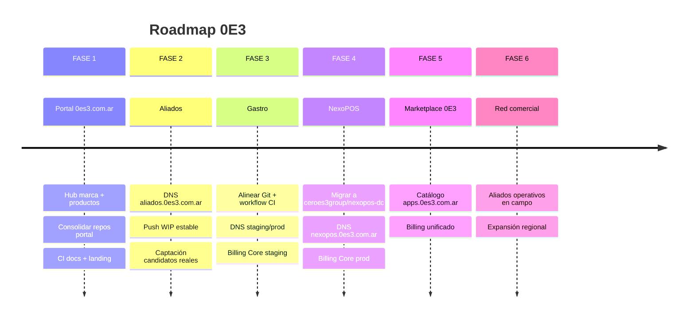

# Roadmap — Ecosistema 0E3

**Horizonte:** 2026–2028  
**Enfoque:** infraestructura, dominios, productos — sin nuevas features de negocio en esta fase.

---

## Vista por fases

---

## FASE 1 — Portal 0E3

| Entregable | Estado |
|---|---|
| Landing live (`0e3.com.ar`) | ✅ |
| Redirect `0es3.com.ar` | ✅ |
| Repo `0e3-docs` central | ✅ |
| Portal en `0es3.com.ar` como apex | ⏸ |
| Consolidar `0e3-home` = portal web | ⏸ |
| Sección Productos en hub | ✅ (landing `/apps/`) |
| Estandarizar ramas `main`/`develop` | ⏸ |

---

## FASE 2 — Aliados

| Entregable | Estado |
|---|---|
| Repo GitHub `0e3-aliados-comerciales` | ✅ |
| Doc arquitectura | ✅ |
| DNS `aliados.0es3.com.ar` | ⏸ |
| Estabilizar WIP local → `develop` | ⏸ |
| Wizard + OTP en producción | ⏸ (staging OK) |

---

## FASE 3 — Gastro

| Entregable | Estado |
|---|---|
| Repo GitHub `0e3-gastro` | ✅ |
| Alinear historial Git local/remoto | ⏸ |
| Workflow CI en GitHub | ⏸ (scope `workflow`) |
| DNS custom staging/prod | ⏸ |
| Billing Core adapter staging | ⏸ diseño |

---

## FASE 4 — NexoPOS

| Entregable | Estado |
|---|---|
| Repo bajo `ceroes3group` | ⏸ |
| DNS `nexopos.0es3.com.ar` | ⏸ |
| Billing MP prod estable | ✅ operativo |
| Migración Billing Core | ⏸ diseño |

---

## FASE 5 — Marketplace 0E3

- `apps.0es3.com.ar` — launcher unificado
- Suscripciones cross-product (Billing Core)
- Panel admin 0E3

---

## FASE 6 — Red comercial

- Aliados comerciales en campo
- Métricas de captación y conversión
- Integración CRM / reporting

---

## Priorización transversal

| Prioridad | Tema |
|---|---|
| 🔴 Alta | Secretos, Gastro OTA/billing, POS prod |
| 🟡 Media | Dominios, CI/CD, alineación Git |
| 🟢 Baja | Node 22, marketplace, docs.0es3.com.ar |

Detalle tareas: [`reports/FASE-CONSOLIDACION-FINAL.md`](reports/FASE-CONSOLIDACION-FINAL.md)
