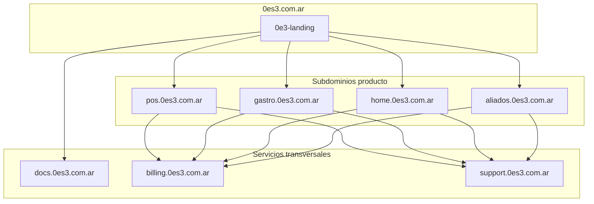

# Estructura final del ecosistema 0E3

**Versión:** 1.0  
**Fecha:** 2026-05-27  
**Estado:** Propuesta estratégica — pendiente aprobación formal

---

## Visión

Un ecosistema **modular y escalable** donde cada producto es independiente en repo, deploy y dominio, con módulos transversales (Billing, Support, Docs) como servicios compartidos.

---

## Portal — apex `0es3.com.ar`

```
https://0es3.com.ar          → Portal institucional (hub)
https://www.0es3.com.ar      → Redirect apex
```

**Contenido:** marca, productos, demos, contacto, links a apps.  
**Repo:** `ceroes3group/0e3-landing` (hoy) → mantener hasta cutover DNS.  
**Stack:** Next.js export estático → Firebase Hosting.

---

## Repositorios definitivos

| Repo GitHub | Producto | Stack | Prioridad |
|---|---|---|---|
| `0e3-landing` | Portal institucional | Next.js | ✅ Existe |
| `0e3-pos` | 0E3 POS / NexoPOS | React + Functions | Migrar desde org externa |
| `0e3-gastro` | 0E3 Gastro | Flutter + Functions | ✅ Existe |
| `0e3-home-app` | 0E3 HOME (finanzas) | Flutter | Renombrar desde `0e3-home` |
| `0e3-aliados-comerciales` | Aliados Comerciales | React + Functions | ✅ Existe |
| `0e3-docs` | Documentación | Markdown | ✅ Existe |
| `0e3-billing` | Billing Core (futuro) | Functions TS | Fase post-N |
| `0e3-support` | Support Core (futuro) | Functions + UI | Fase post-N |

---

## Mapa de dominios

| Dominio | Destino | Repo |
|---|---|---|
| `0es3.com.ar` | Portal hub | `0e3-landing` |
| `pos.0es3.com.ar` | 0E3 POS | `0e3-pos` |
| `gastro.0es3.com.ar` | 0E3 Gastro web/APK prod | `0e3-gastro` |
| `home.0es3.com.ar` | App 0E3 HOME (web) | `0e3-home-app` |
| `aliados.0es3.com.ar` | Aliados Comerciales | `0e3-aliados-comerciales` |
| `docs.0es3.com.ar` | Documentación pública | `0e3-docs` |
| `billing.0es3.com.ar` | Admin billing / callbacks UI | `0e3-billing` |
| `support.0es3.com.ar` | Portal soporte / tickets | `0e3-support` |
| `apps.0es3.com.ar` | Launcher apps (opcional Fase 5) | portal redirect |

### Staging (sin mezclar con prod)

| Dominio | Uso |
|---|---|
| `staging.gastro.0es3.com.ar` | Gastro web PWA staging |
| `staging.0es3.com.ar` | Gastro APK/OTA/billing — **crítico** |

---

## Diagrama ecosistema



---

## Ventajas de esta estructura

| Ventaja | Detalle |
|---|---|
| **Claridad** | Un nombre = un producto = un repo |
| **Deploy aislado** | Fallo en Gastro no afecta portal |
| **Escalabilidad** | Nuevos productos = nuevo repo + subdominio |
| **Seguridad** | Secrets y rules por proyecto Firebase |
| **Equipos** | Ownership claro por repo |
| **Billing/Support** | Módulos transversales sin mezclar en portal |
| **DNS predecible** | `{producto}.0es3.com.ar` |
| **Onboarding dev** | Clone el repo correcto sin sorpresas |

---

## Plan de transición (sin código)

| Paso | Acción | Riesgo |
|---|---|---|
| 1 | Aprobar naming oficial (este doc) | — |
| 2 | Renombrar GitHub `0e3-home` → `0e3-home-app` | 🟡 Media |
| 3 | Migrar `nexopos-dc` → `ceroes3group/0e3-pos` | 🔴 Alta |
| 4 | Cutover DNS `0es3.com.ar` → portal | 🟡 Media |
| 5 | Cutover subdominios producto | 🟡–🔴 |
| 6 | Crear repos `0e3-billing`, `0e3-support` | 🟢 Baja |

---

## Qué NO hacer

- ❌ Mezclar portal + POS + Gastro en un monorepo deployable
- ❌ Procesar pagos en portal
- ❌ Usar `0e3-home` para portal y app a la vez
- ❌ Renombrar Firebase site IDs en producción

---

## Referencias

- Ownership map: [`0e3-product-ownership-map.md`](0e3-product-ownership-map.md)
- Dominios detalle: [`../dominios.md`](../dominios.md)
- Git branches: [`../support-core/git-branch-strategy.md`](../support-core/git-branch-strategy.md)
