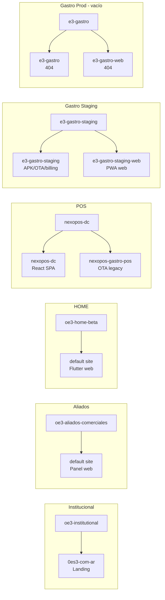
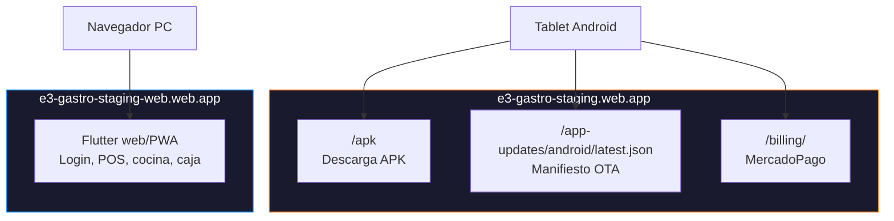
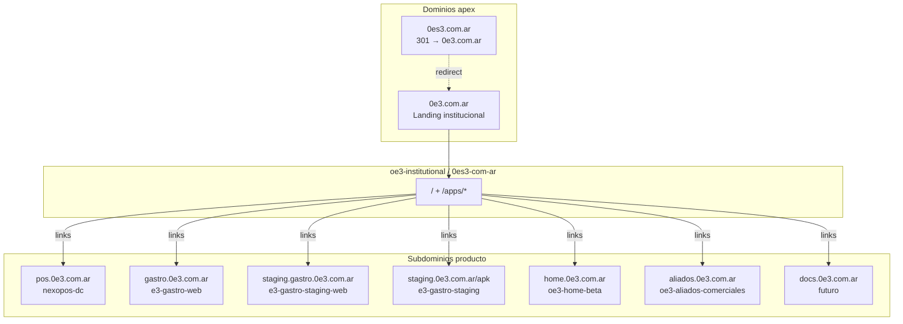
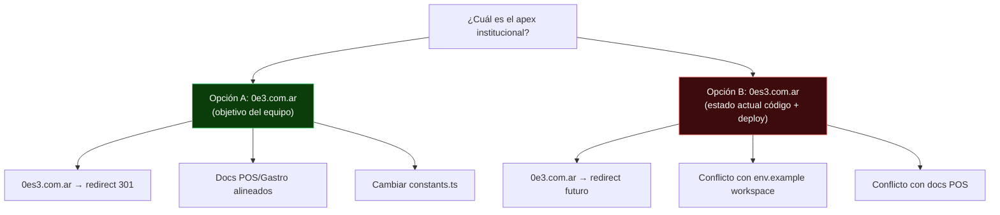

# Auditoría técnica — Ecosistema 0E3: dominios, hosting, apps y enlaces

**Workspace:** `c:\Users\Asus\Proyectos`  
**Fecha:** 2026-05-28  
**Tipo:** Auditoría read-only (sin cambios en código, Firebase ni deploys)  
**Objetivo:** Organizar web raíz, apps, redirecciones, Firebase Hosting y enlaces internos.

**Decisión de producto declarada por el equipo:**

- `https://0e3.com.ar` → web raíz / institucional
- `https://0es3.com.ar` → redirect alternativo hacia `0e3.com.ar`
- Desde la raíz se accede a cada producto, app y sección

---

## A) Resumen ejecutivo

El ecosistema 0E3 está **fragmentado en 8 proyectos Firebase activos** y **múltiples hosting sites**, con **tres narrativas de dominio en conflicto**:

| Fuente | Apex institucional |
|---|---|
| Objetivo del equipo | **`0e3.com.ar`** (raíz) + **`0es3.com.ar`** como redirect |
| Landing desplegada hoy | **`0es3.com.ar`** canónico en código; live en `0es3-com-ar.web.app` |
| Docs Gastro | **`0es3.com.ar`** comercial + **`0e3.com.ar`** alias/APK |
| Docs POS | **`0e3.com.ar`** institucional + **`pos.0e3.com.ar`** futuro |

### URLs verificadas en vivo (2026-05-28)

| URL | HTTP | Producto / rol |
|---|---|---|
| `https://0es3-com-ar.web.app` | 200 | Landing institucional 0E3 |
| `https://oe3-aliados-comerciales.web.app` | 200 | Panel Aliados Comerciales |
| `https://oe3-home-beta.web.app` | 200 | 0E3 HOME (Flutter web) |
| `https://nexopos-dc.web.app` | 200 | NexoPOS / 0E3 POS (React prod) |
| `https://e3-gastro-staging.web.app` | 200 | Gastro staging — APK/OTA/billing |
| `https://e3-gastro-staging.web.app/apk` | 200 | Descarga APK staging |
| `https://e3-gastro-staging.web.app/app-updates/android/latest.json` | 200 | Manifiesto OTA staging |
| `https://e3-gastro-staging.web.app/billing/` | 200 | Billing MercadoPago staging |
| `https://e3-gastro-staging-web.web.app` | 200 | Gastro web/PWA staging |
| `https://nexopos-gastro-pos.web.app` | 200 | OTA legacy dev |
| `https://nexopos-dc-staging.web.app` | 404 | POS staging sin deploy |
| `https://e3-gastro.web.app` | 404 | Gastro prod APK sin deploy |
| `https://e3-gastro-web.web.app` | 404 | Gastro prod web sin deploy |

### Conclusiones clave

1. **Staging Gastro funciona** (APK, OTA, billing y web PWA).
2. **POS prod funciona** en `nexopos-dc.web.app`.
3. **Landing institucional desplegada** en Firebase `oe3-institutional` / site `0es3-com-ar`.
4. **No hay dominios custom conectados** (`0e3.com.ar`, `0es3.com.ar`).
5. **Conflicto de política:** código landing usa `0es3.com.ar`; el equipo quiere `0e3.com.ar` como raíz.
6. **Riesgo crítico:** `e3-gastro-staging` sirve APK + OTA + billing — no tocar rewrites sin plan.

---

## B) Proyectos encontrados

### B.1 Proyectos 0E3 (core)

| Carpeta | App | pubspec | web/ | android/ | firebase.json | .firebaserc | Tipo |
|---|---|:---:|:---:|:---:|:---:|:---:|---|
| `0E3_WORKSPACE/landing` | `0e3-landing` | ❌ | ❌ | ❌ | ✅ | ✅ | Landing institucional (Next.js) |
| `0E3_WORKSPACE/aliados-comerciales` | `0e3-aliados-comerciales` | ❌ | ✅ | ❌ | ✅ | ✅ | App real (React + Functions) |
| `oe3_home` | `oe3_home` v1.0.7+13 | ✅ | ✅ | ✅ | ✅ | ✅ | App real Flutter beta |
| `nexopos_gastro_pos` | `nexopos_gastro_pos` | ✅ | ✅ | ✅ | ✅ (+4 configs) | ✅ | App real + APK hosting |
| `nexopos_gastro_pos_revision_package` | `nexopos_gastro_pos` v1.0.0+1 | ✅ | ❌ | ✅ | ✅ | ❌ | Copia/snapshot revisión |
| `nexopos-dc-multi-tenant` | `sistema-despensa` (React) | ❌ | ❌ | ❌* | ✅ | ✅ | App real — NexoPOS/0E3 POS |
| `rumbo_nea` | `rumbo_nea` v0.1.0+1 | ✅ | ❌ | ✅ | ✅ | ✅ | App early (Android, sin web) |

\* Capacitor Android en `nexopos-dc-multi-tenant/client/android/`

### B.2 Relacionados conceptualmente (sin hosting 0E3)

| Carpeta | Notas |
|---|---|
| `MiniaturaRecoveryAI` | Herramienta Python local. Sin Firebase/web. |
| `deepcache-viewer` | Desktop/Electron. No producto 0E3 desplegable. |

### B.3 Otros Firebase en workspace (no 0E3 — fuera de alcance)

`PostAp`, `sistema-gestion-gimnasio`, `zeus-distribuidora`, `nuevo-sistema-despensa` + 4 carpetas `*-zip-backup`.

---

## C) Firebase projects / sites detectados

### C.1 Mapa textual

```
oe3-institutional          → site: 0es3-com-ar          (landing)
oe3-aliados-comerciales    → site: default (= project)   (panel aliados)
oe3-home-beta              → site: default (= project)   (Flutter web HOME)
nexopos-dc                 → site: nexopos-dc            (POS React + APK caja)
                           → site: nexopos-gastro-pos    (OTA legacy Gastro dev)
e3-gastro-staging          → site: e3-gastro-staging     (APK/OTA/billing staging)
                           → site: e3-gastro-staging-web (Gastro web/PWA staging)
e3-gastro                  → site: e3-gastro              (APK prod — sin deploy)
                           → site: e3-gastro-web         (web prod — sin deploy)
rumbo-nea                  → sin hosting (Firestore/Storage only)
```

### C.2 Diagrama — Proyectos Firebase 0E3



### C.3 Detalle por proyecto prioritario

#### `0E3_WORKSPACE/landing`

| Campo | Valor |
|---|---|
| Framework | Next.js 16 App Router + TypeScript + Tailwind v4 |
| Firebase project | `oe3-institutional` |
| Hosting site | `0es3-com-ar` (target `production`) |
| Carpeta build | `out/` |
| Comando build | `npm run build:firebase` |
| URL live | https://0es3-com-ar.web.app |
| Canónico en código | `https://0es3.com.ar` (conflicto con objetivo `0e3.com.ar`) |

#### `0E3_WORKSPACE/aliados-comerciales`

| Campo | Valor |
|---|---|
| Stack | React + Vite + Firebase Functions + Firestore |
| Firebase project | `oe3-aliados-comerciales` |
| Hosting public | `web/dist` |
| URL live | https://oe3-aliados-comerciales.web.app |
| Demo local | `/aliados-demo` (modo demo sin Firebase real) |

#### `oe3_home`

| Campo | Valor |
|---|---|
| App | 0E3 HOME — control de gastos |
| Firebase project | `oe3-home-beta` |
| Hosting public | `build/web` |
| URL live | https://oe3-home-beta.web.app (Flutter web detectado) |
| Deploy documentado | Reglas Firestore/Storage; hosting web parece manual |
| APK | Firebase Storage, no Hosting |

#### `nexopos_gastro_pos`

| Config file | Site | Public | Propósito | Estado |
|---|---|---|---|---|
| `firebase.json` | `nexopos-gastro-pos` | `build/app/outputs/flutter-apk` | OTA dev/legacy | ✅ 200 |
| `firebase.gastro-only.json` | `e3-gastro-staging` | APK folder | Staging APK/OTA/billing | ✅ 200 |
| `firebase.gastro-web-staging.json` | `e3-gastro-staging-web` | `build/web` | Gastro PWA staging | ✅ 200 |
| `firebase.gastro-production-hosting.json` | `e3-gastro` | APK folder | Prod APK | ❌ 404 |
| `firebase.gastro-web-production.json` | `e3-gastro-web` | `build/web` | Prod web | ❌ 404 |

**`.firebaserc` projects:** `nexopos-dc` (default), `e3-gastro-staging`, `e3-gastro`

**OTA hardcoded** (`lib/core/config/app_environment.dart`):

- staging → `https://e3-gastro-staging.web.app/app-updates/android/latest.json`
- production → `https://e3-gastro.web.app/app-updates/android/latest.json`
- development → `https://nexopos-gastro-pos.web.app/app-updates/android/latest.json`

#### `nexopos_gastro_pos_revision_package`

| Campo | Valor |
|---|---|
| `.firebaserc` | ❌ No existe |
| Site en firebase.json | `nexopos-gastro-pos` (compartido con proyecto activo) |
| Project en Flutter | `nexopos-dc` |
| web/ | ❌ |
| Tipo | Snapshot/copia — **NO deployar** |

#### `nexopos-dc-multi-tenant`

| Campo | Valor |
|---|---|
| App | NexoPOS DC / 0E3 POS (React CRA) |
| Firebase project prod | `nexopos-dc` |
| Hosting site | `nexopos-dc` |
| Public | `client/build` |
| URL live | https://nexopos-dc.web.app |
| Staging project | `nexopos-dc-staging` → **404 hoy** |
| Fallback URL en código | `https://nexopos-dc.web.app` |

#### `rumbo_nea`

| Campo | Valor |
|---|---|
| Firebase project | `rumbo-nea` |
| Hosting | ❌ No configurado |
| web/ | ❌ |
| android/ | ✅ |
| Dominio mencionado | `rumbo-nea.app` (no Firebase) |

---

## D) URLs actuales funcionando

### D.1 Mapa de dependencias staging Gastro (crítico)



> **Regla operativa:** APK/OTA/billing y web PWA son **dos Firebase sites distintos**. No unificar sin plan.

### D.2 Auth domains Firebase

| authDomain | Proyecto |
|---|---|
| `nexopos-dc.firebaseapp.com` | POS + Gastro dev |
| `e3-gastro-staging.firebaseapp.com` | Gastro staging |
| `oe3-home-beta.firebaseapp.com` | 0E3 HOME |
| `oe3-aliados-comerciales.firebaseapp.com` | Aliados |
| `0es3-com-ar.firebaseapp.com` | Landing |

---

## E) URLs recomendadas finales

> Alineado al objetivo: **`0e3.com.ar` = raíz**, **`0es3.com.ar` = redirect**.

### E.1 Apex y aliases

| URL | Rol | Backend |
|---|---|---|
| **https://0e3.com.ar** | Web raíz institucional | `oe3-institutional` / `0es3-com-ar` |
| **https://www.0e3.com.ar** | Redirect → apex | Cloudflare / Firebase |
| **https://0es3.com.ar** | Redirect 301 → `0e3.com.ar` | Cloudflare |
| **https://www.0es3.com.ar** | Redirect 301 → `0e3.com.ar` | Cloudflare |

### E.2 Subdominios producto

| URL | Rol | Backend actual |
|---|---|---|
| `https://0e3.com.ar/apps` | Catálogo apps (nueva ruta) | Landing Next.js |
| `https://0e3.com.ar/apps/nexopos` | Página comercial NexoPOS | Landing |
| `https://0e3.com.ar/apps/gastro` | Página comercial Gastro | Landing |
| `https://0e3.com.ar/apps/aliados` | Página Aliados | Landing |
| `https://0e3.com.ar/apps/home` | Página 0E3 HOME | Landing |
| `https://pos.0e3.com.ar` | App 0E3 POS | `nexopos-dc` |
| `https://gastro.0e3.com.ar` | Gastro web/PWA prod | `e3-gastro-web` (futuro) |
| `https://staging.gastro.0e3.com.ar` | Gastro web staging | `e3-gastro-staging-web` |
| `https://staging.0e3.com.ar/apk` | APK/OTA Gastro | **`e3-gastro-staging`** |
| `https://home.0e3.com.ar` | 0E3 HOME web | `oe3-home-beta` |
| `https://aliados.0e3.com.ar` | Panel Aliados | `oe3-aliados-comerciales` |
| `https://docs.0e3.com.ar` | Documentación | Futuro |

### E.3 Diagrama — Arquitectura objetivo



### E.4 Redirects de compatibilidad

| URL vieja | Redirect recomendado |
|---|---|
| `0es3-com-ar.web.app` | Mantener (Firebase default) + custom domain |
| `nexopos-dc.web.app` | `pos.0e3.com.ar` (cuando esté listo) |
| `e3-gastro-staging-web.web.app` | `staging.gastro.0e3.com.ar` |
| `e3-gastro-staging.web.app` | Mantener hasta cutover APK planificado |
| `oe3-home-beta.web.app` | `home.0e3.com.ar` |

---

## F) Cambios necesarios en Cloudflare

| Registro / regla | Tipo | Propósito |
|---|---|---|
| `@` en `0e3.com.ar` | A o CNAME (según Firebase) | Apex institucional |
| `www` en `0e3.com.ar` | CNAME o redirect | → apex |
| `@` en `0es3.com.ar` | Redirect 301 | → `https://0e3.com.ar` |
| `www` en `0es3.com.ar` | Redirect 301 | → `https://0e3.com.ar` |
| `pos` | CNAME | Firebase site `nexopos-dc` |
| `gastro` | CNAME | Firebase site `e3-gastro-web` |
| `staging.gastro` | CNAME | `e3-gastro-staging-web` |
| `staging` (APK) | CNAME | **`e3-gastro-staging`** |
| `home` | CNAME | `oe3-home-beta` |
| `aliados` | CNAME | `oe3-aliados-comerciales` |
| `docs` | CNAME | TBD |

**Precaución:** Verificar proxy Cloudflare (naranja vs gris) durante verificación SSL de Firebase.

---

## G) Cambios necesarios en Firebase

| Acción | Proyecto | Site | Prioridad |
|---|---|---|---|
| Custom domain `0e3.com.ar` | `oe3-institutional` | `0es3-com-ar` | P0 |
| Redirect `0es3.com.ar` → `0e3.com.ar` | Cloudflare preferible | — | P0 |
| `pos.0e3.com.ar` | `nexopos-dc` | `nexopos-dc` | P1 |
| `home.0e3.com.ar` | `oe3-home-beta` | default | P1 |
| `aliados.0e3.com.ar` | `oe3-aliados-comerciales` | default | P1 |
| `staging.gastro.0e3.com.ar` | `e3-gastro-staging` | `e3-gastro-staging-web` | P1 |
| APK staging custom domain | `e3-gastro-staging` | `e3-gastro-staging` | P1 |
| Deploy Gastro prod web | `e3-gastro` | `e3-gastro-web` | P2 |
| Deploy Gastro prod APK | `e3-gastro` | `e3-gastro` | P2 |
| **NO tocar** rewrites OTA staging | — | `e3-gastro-staging` | Crítico |

---

## H) Cambios necesarios en código

| Archivo / área | Cambio | Prioridad |
|---|---|---|
| `0E3_WORKSPACE/landing/src/lib/constants.ts` | `site.url` → `https://0e3.com.ar`; links a subdominios | P0 |
| `0E3_WORKSPACE/landing/docs/DEPLOY-FIREBASE.md` | Política apex `0e3.com.ar` | P0 |
| `0E3_WORKSPACE/.env.example` | Ya dice `0e3.com.ar` — alinear landing | P0 |
| `nexopos-dc-multi-tenant/client/src/config/appEnvironment.js` | `REACT_APP_PUBLIC_APP_URL` | P1 |
| `nexopos-dc-multi-tenant/functions/routes/billing-mercadopago.routes.js` | `PUBLIC_APP_URL` | P1 |
| `nexopos-dc-multi-tenant/client/capacitor.config.ts` | URL caja/APK | P1 |
| `nexopos_gastro_pos/lib/core/config/app_environment.dart` | `updateManifestUrl` | P1 |
| `nexopos_gastro_pos/functions/.env.e3-gastro-staging` | `MP_BACK_URL` | P1 |
| `nexopos_gastro_pos/scripts/deploy-staging-apk.ps1` | `APK_MANIFEST_BASE_URL` | P1 |
| Landing: rutas `/apps/*` | Nuevas páginas Next.js | P2 |

---

## I) Links internos a corregir (landing actual)

**Ubicación:** `0E3_WORKSPACE/landing`  
**Rutas:** solo `/` (export estático, 1 página)  
**Deploy:** https://0es3-com-ar.web.app

### Secciones

Hero → **Accesos** (`#accesos`) → Productos → Filosofía → Experiencia → TechStack → Contacto → Footer

**Nav header:** Accesos, Productos, Filosofía, Contacto

### Inventario de links

| Link | Estado | Acción recomendada |
|---|---|---|
| `#accesos`, `#productos`, `#filosofia`, `#contacto` | ✅ OK | Mantener |
| `#aliados-comerciales` | ✅ OK | Mantener |
| `mailto:ceroes3group@gmail.com` | ✅ OK | Mantener |
| `https://nexopos-dc.web.app` | ✅ Funciona | → `pos.0e3.com.ar` |
| `https://e3-gastro-web.web.app` | ❌ 404 | → staging funcional o subdominio |
| `https://github.com/ceroes3group/0e3-docs` | ✅ Externo | → `docs.0e3.com.ar` (futuro) |
| 0E3 HOME → mailto | ⚠️ Parcial | → `home.0e3.com.ar` |
| Aliados → ancla + mailto | ⚠️ Parcial | → `/apps/aliados` + `aliados.0e3.com.ar` |
| LinkedIn `#` | ❌ Placeholder | Completar u ocultar |
| WhatsApp `#` | ❌ Placeholder | Completar u ocultar |
| Logo `#` | ⚠️ | → `#accesos` |
| Tarjetas Productos | Sin links | Agregar href |

### Links faltantes

- Aliados desplegado: `oe3-aliados-comerciales.web.app`
- 0E3 HOME web: `oe3-home-beta.web.app` (200, no enlazado)
- Gastro web apunta a prod 404 en vez de staging funcional
- No existen rutas `/apps/*`

---

## J) Riesgos y precauciones

| Riesgo | Severidad | Detalle |
|---|---|---|
| `e3-gastro-staging` APK+OTA+billing | 🔴 Crítico | Tablets dependen de OTA JSON |
| `nexopos-gastro-pos` compartido | 🔴 Alto | `revision_package` sin `.firebaserc` |
| Gastro prod sites vacíos | 🟡 Medio | 404 — no tocar hasta deploy |
| POS prod `nexopos-dc` | 🔴 Crítico | Multi-tenant en producción |
| Conflicto apex `0e3` vs `0es3` | 🟡 Medio | Landing ya desplegada con `0es3` |
| Staging POS 404 | 🟡 Bajo | No usar en links |
| Hardcodes `.web.app` | 🟡 Medio | OTA, MP, Capacitor bloquean cutover |
| Auth domains | 🟡 Medio | Custom domain ≠ authDomain |

### Compilación web

| Proyecto | web/ | Deploy web | Evidencia compila |
|---|---|---|---|
| `oe3_home` | ✅ | ✅ | Flutter web en `oe3-home-beta.web.app` |
| `nexopos_gastro_pos` | ✅ | ✅ staging | Deploy doc 2026-05-27 |
| `nexopos_gastro_pos` prod web | ✅ | ❌ | Config lista, 404 |
| `revision_package` | ❌ | ❌ | Solo Android |
| `rumbo_nea` | ❌ | ❌ | Solo Android |
| `landing` | N/A | ✅ | `npm run build:firebase` OK |
| `aliados-comerciales` | ✅ | ✅ | 200 |

---

## K) Plan de ejecución paso a paso

### Fase 0 — Decisión (sin tocar prod)

1. Confirmar: `0e3.com.ar` = raíz, `0es3.com.ar` = redirect.
2. Congelar deploys desde `revision_package`.
3. Documentar matriz dominio → site → proyecto.

### Fase 1 — DNS landing (bajo riesgo)

1. Firebase → `oe3-institutional` → site `0es3-com-ar` → Add domain `0e3.com.ar`.
2. DNS según Firebase.
3. Cloudflare: redirect `0es3.com.ar` → `0e3.com.ar`.
4. Verificar HTTPS + OG.

### Fase 2 — Corregir landing

1. `site.url` → `https://0e3.com.ar`.
2. Gastro web link → staging funcional.
3. Agregar links HOME y Aliados.
4. Redeploy: `npm run deploy:hosting`.

### Fase 3 — Subdominios producto

1. `home.0e3.com.ar` → `oe3-home-beta`
2. `aliados.0e3.com.ar` → `oe3-aliados-comerciales`
3. `staging.gastro.0e3.com.ar` → `e3-gastro-staging-web`
4. APK: `staging.0e3.com.ar` → `e3-gastro-staging`

### Fase 4 — POS cutover (alto riesgo)

1. `REACT_APP_PUBLIC_APP_URL=https://pos.0e3.com.ar`
2. Rebuild + deploy POS
3. Functions `PUBLIC_APP_URL`
4. DNS `pos.0e3.com.ar`

### Fase 5 — Rutas `/apps/*`

1. Páginas Next.js por producto
2. Links en hub y tarjetas

### Fase 6 — Gastro prod

1. Deploy web + APK prod
2. Actualizar OTA URLs
3. DNS `gastro.0e3.com.ar`

---

## L) Comandos exactos build/deploy

### Landing institucional

```powershell
cd C:\Users\Asus\Proyectos\0E3_WORKSPACE\landing
npm install
npm run build:firebase
npm run deploy:hosting
# manual:
firebase deploy --only hosting:production --project oe3-institutional
```

### Aliados Comerciales

```powershell
cd C:\Users\Asus\Proyectos\0E3_WORKSPACE\aliados-comerciales
npm run deploy:hosting
```

### 0E3 HOME web

```powershell
cd C:\Users\Asus\Proyectos\oe3_home
flutter pub get
flutter build web
firebase deploy --only hosting --project oe3-home-beta
```

### NexoPOS / 0E3 POS

```powershell
cd C:\Users\Asus\Proyectos\nexopos-dc-multi-tenant\client
npm install
npm run build
cd ..
firebase deploy --only hosting --project nexopos-dc
```

### Gastro — web staging

```powershell
cd C:\Users\Asus\Proyectos\nexopos_gastro_pos
flutter pub get
flutter build web --dart-define=APP_ENV=staging --dart-define=FIREBASE_PROJECT_ID=e3-gastro-staging
firebase deploy --only hosting:gastro-web --config firebase.gastro-web-staging.json --project e3-gastro-staging
# o:
.\scripts\deploy-staging-web.ps1
```

### Gastro — APK/OTA staging (⚠️ crítico)

```powershell
cd C:\Users\Asus\Proyectos\nexopos_gastro_pos
.\scripts\deploy-staging-apk.ps1
$env:APK_MANIFEST_BASE_URL = "https://staging.0e3.com.ar"  # solo tras DNS
firebase deploy --only hosting:staging --config firebase.gastro-only.json --project e3-gastro-staging
```

---

## M) Archivos a modificar

### P0 — Dominio raíz y landing

- `0E3_WORKSPACE/landing/src/lib/constants.ts`
- `0E3_WORKSPACE/landing/src/app/layout.tsx`
- `0E3_WORKSPACE/landing/docs/DEPLOY-FIREBASE.md`
- `0E3_WORKSPACE/landing/README.md`

### P1 — Enlaces ecosistema

- `0E3_WORKSPACE/landing/src/components/EcosystemAccess.tsx`
- `0E3_WORKSPACE/landing/src/components/Products.tsx`
- `0E3_WORKSPACE/landing/src/components/Hero.tsx`
- `0E3_WORKSPACE/landing/src/components/Contact.tsx`

### P1 — POS cutover

- `nexopos-dc-multi-tenant/client/src/config/appEnvironment.js`
- `nexopos-dc-multi-tenant/client/.env.example`
- `nexopos-dc-multi-tenant/functions/routes/billing-mercadopago.routes.js`
- `nexopos-dc-multi-tenant/client/capacitor.config.ts`
- `nexopos-dc-multi-tenant/docs/env-domains-0e3.md`

### P1 — Gastro OTA/billing

- `nexopos_gastro_pos/lib/core/config/app_environment.dart`
- `nexopos_gastro_pos/functions/.env.e3-gastro-staging`
- `nexopos_gastro_pos/scripts/deploy-staging-apk.ps1`
- `nexopos_gastro_pos/docs/domain-setup.md`

### P2 — Rutas `/apps/*`

- `0E3_WORKSPACE/landing/src/app/apps/page.tsx` (nuevo)
- `0E3_WORKSPACE/landing/src/app/apps/nexopos/page.tsx` (nuevo)
- `0E3_WORKSPACE/landing/src/app/apps/gastro/page.tsx` (nuevo)
- `0E3_WORKSPACE/landing/src/app/apps/aliados/page.tsx` (nuevo)
- `0E3_WORKSPACE/landing/src/app/apps/home/page.tsx` (nuevo)

### NO modificar (salvo decisión explícita)

- `0E3_WORKSPACE/aliados-comerciales/**`
- `nexopos_gastro_pos_revision_package/**`
- `firebase.gastro-only.json` rewrites OTA
- `*-zip-backup/**`

---

## N) Conflicto de dominios — matriz de decisión



**Recomendación (mínimo riesgo):**

1. Agregar `0e3.com.ar` como custom domain al site existente `0es3-com-ar`.
2. Redirect `0es3.com.ar` → `0e3.com.ar` vía Cloudflare.
3. Cambiar `site.url` en código.
4. **No renombrar** el Firebase site ID.

---

## O) Variables de entorno con URLs (sin secretos)

| Archivo | Variable | Valor |
|---|---|---|
| `0E3_WORKSPACE/.env.example` | `PUBLIC_WEBSITE_URL` | `https://0e3.com.ar` |
| `0E3_WORKSPACE/landing/src/lib/constants.ts` | `site.url` | `https://0es3.com.ar` ⚠️ |
| `nexopos-dc-multi-tenant/client/.env.staging` | `REACT_APP_PUBLIC_APP_URL` | `https://nexopos-dc-staging.web.app` |
| `nexopos_gastro_pos/functions/.env.e3-gastro-staging` | `MP_BACK_URL` | `https://e3-gastro-staging.web.app/billing/` |
| `0E3_WORKSPACE/aliados-comerciales/web/.env` | `VITE_FIREBASE_AUTH_DOMAIN` | `oe3-aliados-comerciales.firebaseapp.com` |

**Fallbacks en código (sin .env):**

- POS: `https://nexopos-dc.web.app` (`appEnvironment.js`)
- Gastro OTA staging: `https://e3-gastro-staging.web.app/app-updates/android/latest.json`
- MP billing: `https://e3-gastro-staging.web.app/billing/`

---

## P) Preguntas abiertas para GPT / decisión de arquitectura

1. ¿Confirmamos `0e3.com.ar` como apex único institucional?
2. ¿`app.0e3.com.ar` es hub de apps o solo alias de POS?
3. ¿Gastro staging web usa `staging.gastro.0e3.com.ar` o `staging.0es3.com.ar`?
4. ¿APK staging queda en `staging.0e3.com.ar` (doc actual) o `download.0e3.com.ar`?
5. ¿Cuándo hacer cutover POS de `nexopos-dc.web.app` a `pos.0e3.com.ar`?
6. ¿Landing sigue export estático o migra a multi-page para `/apps/*`?
7. ¿Aliados se enlaza desde landing o solo vía subdominio directo?

---

*Documento generado para handoff a ChatGPT / decisión de arquitectura. Auditoría read-only — 2026-05-28.*
