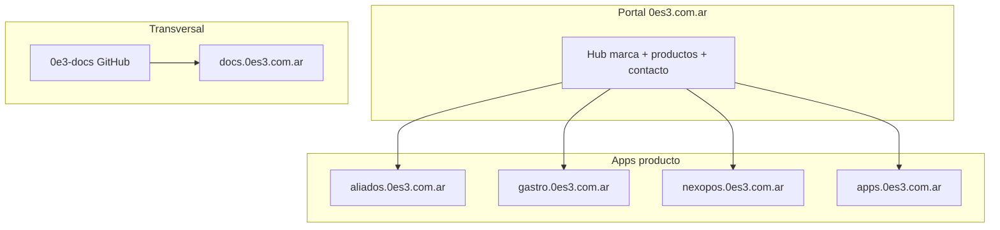

# Arquitectura general — Ecosistema 0E3

**Versión:** 1.0  
**Fecha:** 2026-05-27  
**Principio:** un producto = un repo = un deploy = un proyecto Firebase (salvo excepciones documentadas).

---

## Visión

0E3 es un ecosistema de productos SaaS (POS, Gastro, Home, Aliados) bajo marca unificada, con:

- **Portal corporativo** (hub de marca y accesos) — sin lógica de negocio
- **Apps producto** independientes en subdominios
- **Documentación central** en `0e3-docs`
- **Billing** por producto (futuro Billing Core transversal — ver `billing/`)

---

## Organización GitHub (`ceroes3group`)

| Repo | Rol objetivo | Stack | Deploy |
|---|---|---|---|
| [0e3-home](https://github.com/ceroes3group/0e3-home) | **Portal corporativo** → `0es3.com.ar` | Next.js / estático (objetivo) | Firebase `oe3-institutional` o site dedicado |
| [0e3-landing](https://github.com/ceroes3group/0e3-landing) | Landing institucional (transición) | Next.js 16 | Firebase site `0es3-com-ar` |
| [0e3-aliados-comerciales](https://github.com/ceroes3group/0e3-aliados-comerciales) | Aliados Comerciales | React + Functions | `oe3-aliados-comerciales` |
| [0e3-gastro](https://github.com/ceroes3group/0e3-gastro) | NexoPOS Gastro | Flutter + Functions | `e3-gastro-staging` / `e3-gastro` |
| [0e3-docs](https://github.com/ceroes3group/0e3-docs) | Documentación transversal | Markdown | GitHub / futuro `docs.0es3.com.ar` |
| `nexopos-dc` (externo hoy) | NexoPOS POS | React + Functions | `nexopos-dc` |

**Futuras apps:** nuevo repo por producto bajo `ceroes3group/`, sin mezclar deploys.

---

## Estado actual vs objetivo (portal)

| Aspecto | Hoy | Objetivo |
|---|---|---|
| Portal público | `0e3.com.ar` — repo `0e3-landing` | `0es3.com.ar` — repo `0e3-home` como **hub** |
| Repo `0e3-home` en GitHub | Contiene app Flutter finanzas (`oe3_home`) | Renombrar/migrar: portal web en `0e3-home`, app finanzas → `0e3-home-app` o similar |
| Sección Productos | ✅ En landing `/apps/` | Mantener en portal hub (misma estructura) |

> **No confundir:** la app Flutter “0E3 HOME” (finanzas personales) ≠ portal corporativo “0e3-home”. Consolidación de repos es tarea de infraestructura, no de lógica de negocio.

---

## Capas por producto

---

## Reglas de separación

1. **No mezclar** APK/OTA/billing Gastro con web PWA en un solo site sin plan.
2. **No procesar pagos SaaS** en el portal — solo links a apps.
3. **Secrets** solo en Secret Manager / env local — nunca en Git.
4. **Un dominio custom** → un hosting site Firebase (documentado en `dominios.md`).
5. **CI/CD** estándar por tipo: web (Node), Flutter, docs (markdown).

---

## Portal corporativo — contenido hub

El portal (`0es3.com.ar`) debe incluir:

| Sección | Contenido |
|---|---|
| Inicio | Marca, propuesta de valor |
| **Productos** | Aliados, Gastro, NexoPOS, Apps, Próximamente |
| Demos | Links a demos operativas (.web.app o subdominio) |
| Aliados | CTA al wizard público |
| Contacto | Email, GitHub, formulario placeholder |
| Docs | Link a `docs.0es3.com.ar` / GitHub |

Especificación detallada de productos: [`support-core/portal-products-spec.md`](support-core/portal-products-spec.md)

---

## Referencias

- Dominios: [`dominios.md`](dominios.md)
- Deploy: [`deploy.md`](deploy.md)
- Seguridad: [`seguridad.md`](seguridad.md)
- Git: [`support-core/git-branch-strategy.md`](support-core/git-branch-strategy.md)
- CI/CD: [`support-core/ci-cd-standard.md`](support-core/ci-cd-standard.md)
- Roadmap: [`roadmap.md`](roadmap.md)
