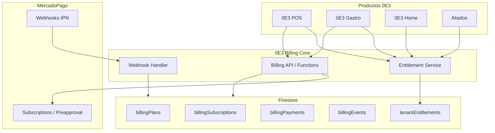

# 0E3 Billing Core — Especificación transversal

**Versión:** 0.1 (diseño)  
**Fecha:** 2026-05-27  
**Estado:** Documentación — **sin implementación**

---

## Propósito

**0E3 Billing Core** es el módulo conceptual transversal para cobrar **abonos SaaS** de productos 0E3 mediante MercadoPago, validar **entitlements** y habilitar/bloquear uso **sin borrar datos del cliente**.

**Principios:**

1. `0e3.com.ar` **no procesa pagos** — solo institucional.
2. Cada producto hospeda su UI de billing; el **core** define modelo, APIs y reglas.
3. Un **tenant** puede tener suscripciones por **productId** independientes.
4. Falta de pago → **bloqueo funcional**, nunca borrado de datos.
5. Admin 0E3 puede **reactivar manualmente**.

---

## Arquitectura lógica



---

## Identificadores

| Campo | Descripción |
|---|---|
| `tenantId` | Organización/cliente 0E3 (puede mapear a `orgId` POS o `tenantId` Gastro) |
| `productId` | `pos`, `gastro`, `home`, `aliados` |
| `businessId` | Opcional — sucursal/unidad dentro del tenant |
| `planId` | Referencia a `billingPlans/{planId}` |

---

## Colecciones Firestore

### `billingPlans/{planId}`

Catálogo de planes por producto.

| Campo | Tipo | Notas |
|---|---|---|
| `productId` | string | `pos`, `gastro`, … |
| `name` | string | Etiqueta comercial |
| `amount` | number | ARS |
| `currency` | string | `ARS` |
| `billingFrequency` | string | `monthly`, `yearly`, `one_time` |
| `trialDays` | number | 0 = sin trial |
| `graceDays` | number | Días post `past_due` |
| `features` | map | Flags módulos/límites |
| `mercadoPagoPreapprovalPlanId` | string | Opcional — plan MP |
| `active` | boolean | Visible en checkout |
| `createdAt`, `updatedAt` | timestamp | |

### `billingSubscriptions/{subscriptionId}`

Suscripción activa o histórica.

| Campo | Tipo | Requerido |
|---|---|:---:|
| `id` | string | ✅ |
| `tenantId` | string | ✅ |
| `productId` | string | ✅ |
| `businessId` | string | — |
| `planId` | string | ✅ |
| `provider` | string | ✅ (`mercadoPago`) |
| `providerSubscriptionId` | string | ✅ |
| `providerPayerId` | string | — |
| `status` | string | ✅ |
| `statusDetail` | string | — |
| `amount` | number | ✅ |
| `currency` | string | ✅ |
| `billingFrequency` | string | ✅ |
| `startDate` | timestamp | ✅ |
| `nextBillingDate` | timestamp | — |
| `trialEndsAt` | timestamp | — |
| `activeUntil` | timestamp | ✅ |
| `graceUntil` | timestamp | — |
| `canceledAt` | timestamp | — |
| `lastPaymentId` | string | — |
| `lastPaymentStatus` | string | — |
| `createdAt`, `updatedAt` | timestamp | ✅ |

**Índices sugeridos:** `(tenantId, productId, status)`, `(providerSubscriptionId)`

### `billingInvoices/{invoiceId}`

Facturas lógicas por período (opcional fase 1; útil para reporting).

### `billingPayments/{paymentId}`

Pagos individuales confirmados.

| Campo | Notas |
|---|---|
| `subscriptionId` | FK |
| `providerPaymentId` | ID MP |
| `status` | `approved`, `rejected`, `pending`, `refunded` |
| `amount`, `currency` | |
| `paidAt` | timestamp acreditación |
| `rawProviderPayload` | snapshot sanitizado |

### `billingEvents/{eventId}`

Eventos de dominio (auditoría interna).

### `billingWebhooks/{eventId}`

**Payload crudo** recibido de MP + headers + resultado procesamiento.

| Campo | Notas |
|---|---|
| `provider` | `mercadoPago` |
| `providerEventId` | idempotencia |
| `payload` | JSON crudo |
| `processedAt` | |
| `processingResult` | `ok`, `ignored`, `error` |
| `errorMessage` | |

### `tenantEntitlements/{tenantId}_{productId}`

Vista materializada para consulta rápida por producto.

| Campo | Notas |
|---|---|
| `tenantId`, `productId` | Clave compuesta |
| `subscriptionId` | FK activa |
| `status` | Estado efectivo |
| `activeUntil`, `graceUntil`, `trialEndsAt` | |
| `features` | Mapa habilitaciones |
| `blocked` | boolean |
| `blockReason` | string |
| `updatedAt` | |

### `productAccess/{docId}`

Registro opcional de checks / auditoría de acceso (rate-limited).

---

## Estados de suscripción

| Estado | Uso permitido | Transiciones típicas |
|---|---|---|
| `trial` | ✅ Full (límites trial) | → `active`, `expired` |
| `pending` | ⏸ Checkout iniciado | → `active`, `expired` |
| `active` | ✅ Full | → `past_due`, `paused`, `canceled` |
| `paused` | ⚠️ Solo lectura configurable | → `active`, `canceled` |
| `past_due` | ⚠️ Gracia configurable | → `active`, `blocked`, `expired` |
| `canceled` | ❌ Tras fin período pagado | → `expired` |
| `expired` | ❌ Bloqueo funcional | → `active` (reactivación) |
| `blocked` | ❌ Bloqueo admin/fraud | → `active` (manual) |

---

## Reglas de negocio

### Acceso

```
SI status IN (active, trial) Y now < activeUntil/trialEndsAt → PERMITIR
SI status == past_due Y now < graceUntil → PERMITIR (modo gracia)
SI status IN (expired, blocked) O now >= activeUntil → BLOQUEAR funciones críticas
NUNCA eliminar datos por falta de pago
```

### Bloqueo

- Bloquear: crear ventas, sync, exports, invitaciones — según producto
- Permitir: login, ver billing, export datos (GDPR), contacto soporte
- Admin 0E3: endpoint/callable `reactivateEntitlement`

### Multi-producto

Un tenant puede tener:
- `tenantEntitlements/acme_pos` → active
- `tenantEntitlements/acme_gastro` → trial

Cada app consulta **solo su `productId`**.

---

## API conceptual (Functions)

| Endpoint / Callable | Descripción |
|---|---|
| `billing.getPlans(productId)` | Lista planes activos |
| `billing.createCheckout(tenantId, productId, planId)` | Inicia MP checkout/preapproval |
| `billing.cancelSubscription(subscriptionId)` | Cancelación |
| `billing.getEntitlement(tenantId, productId)` | Estado efectivo |
| `billing.webhook.mercadopago` | POST webhook MP |
| `billing.admin.manualActivate(...)` | Reactivación manual |
| `billing.admin.extendGrace(...)` | Extender gracia |

**Autenticación:** Firebase Auth + verificación rol owner/admin del tenant.

---

## Migración desde legacy

| Producto | Mapping legacy → Core |
|---|---|
| POS | `orgId` → `tenantId`; `paidUntil` → `activeUntil`; `licenses/{id}` → adapter |
| Gastro | `tenants/{id}.licenseEndsAt` → `activeUntil`; mantener subcollections durante transición |
| HOME | Greenfield — escribir directo en Core |
| Aliados | Greenfield |

**Feature flag:** `billingCoreEnabled: boolean` por tenant/producto.

---

## Fuera de alcance v0.1

- Marketplace / split payments OAuth MP
- Facturación AFIP electrónica
- Multi-moneda fuera ARS
- Cobro in-app de ventas (MercadoPago en mostrador POS) — dominio separado

---

## Referencias

- Auditoría: [`0e3-billing-current-audit.md`](0e3-billing-current-audit.md)
- MercadoPago: [`mercadopago-integration-plan.md`](mercadopago-integration-plan.md)
- Entitlements: [`0e3-entitlements-access-control.md`](0e3-entitlements-access-control.md)
