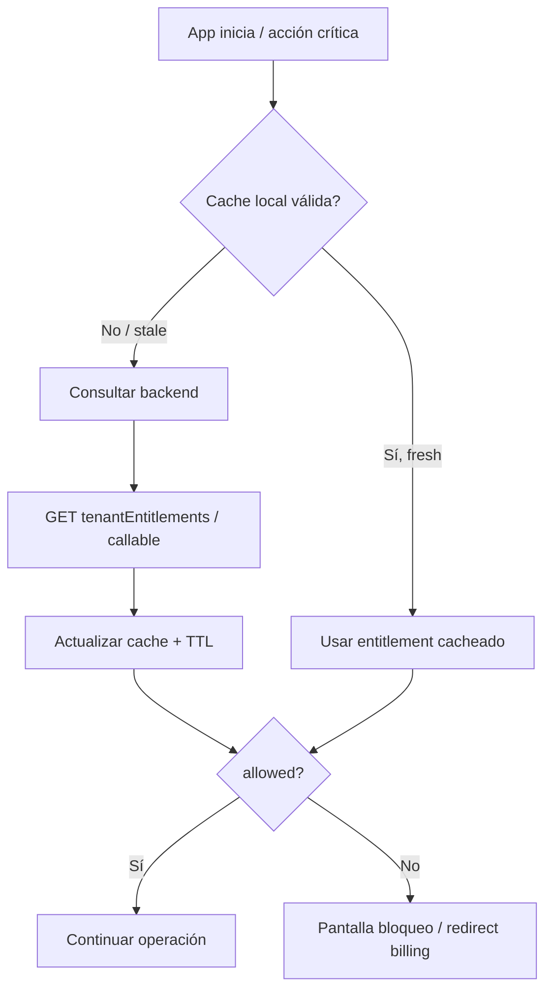

# Entitlements y control de acceso — 0E3 Billing Core

**Versión:** 0.1 (diseño)  
**Fecha:** 2026-05-27

---

## Objetivo

Definir cómo cada app 0E3 **consulta, cachea y aplica** el estado de suscripción para habilitar o bloquear uso — sin eliminar datos del cliente.

---

## Flujo de consulta



---

## Fuente de verdad

| Prioridad | Fuente |
|---|---|
| 1 | `tenantEntitlements/{tenantId}_{productId}` (Firestore) |
| 2 | Callable `billing.getEntitlement` (compone desde subscription) |
| 3 | Cache local app (derivado, no autoritativo) |

**Backend siempre gana** sobre cache en acciones críticas (Functions, pagos, sync).

---

## Contrato `EntitlementSnapshot`

```typescript
{
  tenantId: string;
  productId: string;
  status: 'trial' | 'pending' | 'active' | 'paused' | 'past_due' | 'canceled' | 'expired' | 'blocked';
  allowed: boolean;           // decisión computada
  mode: 'full' | 'grace' | 'read_only' | 'blocked';
  activeUntil: string | null;   // ISO
  graceUntil: string | null;
  trialEndsAt: string | null;
  planId: string;
  features: Record<string, boolean | number>;
  blockReason?: string;
  checkoutUrl?: string;         // si pending/past_due
  updatedAt: string;
}
```

### Reglas `allowed`

```
allowed = true SI:
  (status == 'active' Y now < activeUntil)
  O (status == 'trial' Y now < trialEndsAt)
  O (status == 'past_due' Y now < graceUntil)
  O (status == 'paused' Y mode read_only configurado)

allowed = false SI:
  status IN ('expired', 'blocked')
  O now >= activeUntil (sin gracia)
  O blocked == true (admin)
```

---

## Por capa de aplicación

### Frontend (React / Flutter)

| Momento | Acción |
|---|---|
| Login / bootstrap | Fetch entitlement |
| Navegación ruta protegida | Guard middleware |
| Cada 5–15 min foreground | Refresh background |
| Post-checkout return | Force refresh |

**POS legacy hoy:** middleware en API + estado `lic` en configuración empresa.  
**Gastro legacy hoy:** `session_redirect.dart` + `BillingSummary` dashboard.

### Backend (Functions)

| Momento | Acción |
|---|---|
| Callable crítico | `assertEntitlement(tenantId, productId, action)` |
| Webhook MP | Actualizar entitlement |
| Cron opcional | Expirar `past_due` → `expired` |

**Gastro legacy:** `assertTenantLicenseIsUsable()` — **no modificar** hasta migración.

---

## Caché offline limitado

| Parámetro | Valor sugerido |
|---|---|
| TTL online | 5 minutos |
| TTL offline grace | 24–72 horas (configurable por producto) |
| Acciones offline permitidas | Lectura cacheada, cola sync |
| Acciones offline bloqueadas | Nuevo checkout MP, cambio plan |

**Regla:** offline extendido solo si último entitlement conocido era `active` o `trial` y TTL offline no venció.

---

## Modo gracia (`past_due`)

| Config | Default |
|---|---|
| `graceDays` en plan | 3–7 días |
| UX | Banner persistente + email (futuro) |
| Funcionalidad | Full o read-only según producto |
| Fin gracia | status → `expired`, `allowed = false` |

---

## Bloqueo elegante

### Pantalla `Suscripción vencida`

Elementos obligatorios:

- Título claro: "Tu suscripción necesita atención"
- Estado actual: plan, vencimiento, último pago
- **Botón primario:** "Regularizar pago" → checkout MP
- **Botón secundario:** Contactar soporte / WhatsApp 0E3
- **No mostrar:** stack traces, IDs internos MP
- **Sí permitir:** logout, cambiar tenant (si multi), ver facturación

### Rutas permitidas cuando bloqueado

| Ruta | Permitida |
|---|---|
| `/billing`, `/billing/*` | ✅ |
| `/login`, `/logout` | ✅ |
| `/settings/account` | ✅ |
| `/pos`, `/ventas`, operaciones CRUD | ❌ |

**Gastro:** patrón existente en `session_redirect.dart` — extender, no romper.

---

## Panel admin 0E3

Callable / panel interno:

| Acción | Efecto |
|---|---|
| Ver entitlement | Todos los productos del tenant |
| `manualActivate` | status → active, extiende activeUntil |
| `extendGrace` | graceUntil += N días |
| `suspend` | blocked = true |
| `reactivate` | blocked = false, active |
| Audit log | `billingEvents` + `adminLogs` |

**Gastro ya tiene:** `manualPaymentMark`, `extendTrial`, `suspendTenant` — mapear a Billing Core admin.

---

## Mensajes al usuario (es-AR)

| Estado | Mensaje |
|---|---|
| `trial` (≤3 días) | "Tu prueba termina el {fecha}. Activá tu plan para seguir sin interrupciones." |
| `past_due` | "No pudimos cobrar tu abono. Regularizá el pago antes del {graceUntil}." |
| `expired` | "Tu suscripción venció. Tus datos están seguros — reactivá para continuar." |
| `blocked` | "Cuenta suspendida. Contactá soporte@0e3.com.ar" |

---

## Feature flags

| Flag | Uso |
|---|---|
| `billingCoreEnabled` | Usar Core vs legacy |
| `billingCoreReadOnly` | Solo log, no bloquear |
| `billingGraceDaysOverride` | Override por tenant |

---

## Tests requeridos (futuro)

- Entitlement trial vigente → allowed
- past_due dentro gracia → allowed + mode grace
- expired → blocked + rutas billing OK
- Cache stale → refresh
- Offline TTL expired → blocked conservador
- Webhook approved → entitlement actualizado < 30s

---

## Referencias

- Core spec: [`0e3-billing-core-spec.md`](0e3-billing-core-spec.md)
- Gastro policy: `nexopos_gastro_pos/lib/features/tenants/domain/mercado_pago_billing_policy.dart`
- Rollout: [`0e3-billing-rollout-plan.md`](0e3-billing-rollout-plan.md)
