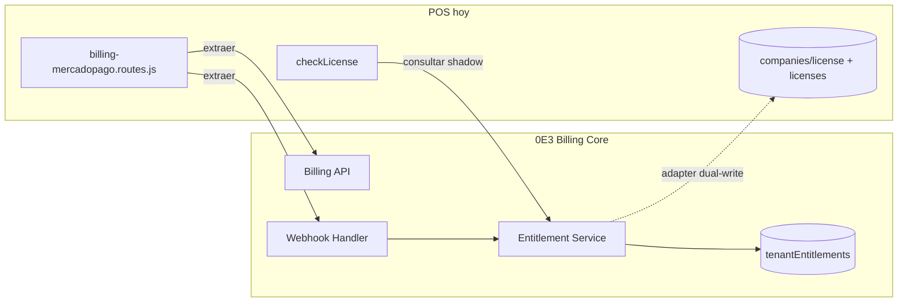

# POS Billing — Plan de extracción hacia 0E3 Billing Core

**Versión:** 1.0  
**Fecha:** 2026-05-27  
**Fuente auditada:** `danielcadiz15/nexopos-dc-multi-tenant` (local: `nexopos-dc-multi-tenant`)  
**Estado:** Auditoría — **sin implementación**

---

## Resumen ejecutivo

El billing de POS es **maduro y en producción**. La extracción no es un copy-paste: es **desacoplar** la lógica transversal (MP, idempotencia, entitlements) del acoplamiento POS-specific (`orgId`, dual-write `companies/.../license` + `licenses/`, onboarding kit, module presets).

---

## Inventario auditado

### Backend — rutas y servicios

| Archivo | Líneas aprox. | Rol |
|---|---|---|
| `functions/routes/billing-mercadopago.routes.js` | ~800 | **Núcleo billing** — MP API, webhook, checkout, preapproval |
| `functions/licenseHelpers.js` | ~96 | Evaluación fases licencia (`paidUntil`, gracia 24h) |
| `functions/utils/onboardingBilling.js` | ~38 | Kit instalación 2×$250k, tolerancia montos |
| `functions/utils/planTiers.js` | — | Normalización `basic/intermediate/premium` |
| `functions/utils/modulePresets.js` | — | Preset módulos por plan (post-onboarding) |
| `functions/utils/subscriptionAccess.js` | ~175 | Límites usuarios/sesiones (no billing puro) |
| `functions/index.js` | parcial | `checkLicense()`, admin billing, routing |

### Frontend

| Archivo | Rol |
|---|---|
| `client/src/services/billing.service.js` | `getBillingPublicConfig()`, preference, preapproval |
| `client/src/utils/billingOnboarding.js` | Fase onboarding vs recurrente en UI |
| `client/src/utils/licenseUi.js` | Banner licencia, estados UI |
| `client/src/components/layout/LicenseBanner.js` | CTA pagar |
| `client/src/pages/configuracion/configuracionempresa.js` | Modal licencia |
| `client/src/pages/admin/AdminPanel.js` | Admin precios `platform/billing` |

### Firestore (legacy POS)

| Colección / doc | Campos clave |
|---|---|
| `platform/billing` | `planPrices`, `monthlyPriceARS`, `onboardingInstallmentAmountARS`, `onboardingInstallmentsTotal` |
| `companies/{orgId}/config/license` | `paidUntil`, `plan`, `chosenPlan`, `blocked`, `billingModel`, `onboardingInstallmentsPaid`, … |
| `licenses/{orgId}` | Espejo legacy de license |
| `billingMercadoPago/pay_{paymentId}` | Idempotencia webhook |

### Endpoints HTTP

| Método | Path | Auth | Rol |
|---|---|---|---|
| GET | `/billing/mercadopago/public-config` | No | Precios + flag MP configurado |
| POST | `/billing/mercadopago/preference` | JWT + company | Checkout Pro |
| POST | `/billing/mercadopago/preapproval` | JWT + company | Suscripción débito |
| POST/GET | `/billing/mercadopago/webhook` | No (MP) | IPN pagos |
| GET/PUT | `/admin/platform/billing` | Super admin | CRUD precios |
| PUT | `/admin/empresas/:id/licencia` | Super admin | Override manual licencia |

### Middleware licencia

`checkLicense()` en `functions/index.js` (~línea 280):

- Bypass super admin
- Fases: `active`, `grace`, `unpaid_grace`, `expired`, `blocked`, `demo_*`, `restricted_pending_activation`
- Gracia **24h** post-`paidUntil` (`GRACE_MS` en `licenseHelpers.js`)
- Bloquea **POST/PUT/PATCH** en `/ventas/*` durante gracia/expiración
- Seed `unpaidGraceStartedAt` en primer request sin `paidUntil`

### Jobs automáticos / cron

| Componente | Estado |
|---|---|
| Firebase `onSchedule` en billing | ❌ **No existe** |
| Expiración licencia | **Lazy** — evaluada en cada request API (`checkLicense`) |
| Webhook MP | **Event-driven** — único trigger de extensión `paidUntil` |
| `meta-sistema-gestion/` node-cron | ⚠️ Subproyecto interno — **no relacionado** con billing POS prod |

**Implicación Billing Core:** considerar job diario opcional para `past_due` / alertas; POS legacy no lo tiene.

---

## Qué se REUTILIZA (→ Billing Core)

| Componente POS | Destino Core | Notas |
|---|---|---|
| `mpFetch()` + `getAccessToken()` | `MercadoPagoClient` | Abstraer env/secrets |
| `processPaymentNotification()` | `webhooks/mercadopago.ts` | Flujo GET payment → validar → aplicar |
| Idempotencia `billingMercadoPago/pay_{id}` | `billingWebhooks/{eventId}` | Mismo patrón, schema unificado |
| `extendLicenseAfterPayment()` lógica 30 días | `subscriptionService.extendActiveUntil()` | Anclar a `date_approved` MP |
| `loadBillingConfig()` / `platform/billing` | `billingPlans` catálogo | Migrar seed, no duplicar admin |
| `amountMatchesMercadoPago()` | Validador compartido | Tolerancia 1% / $5 |
| Checkout preference body | `createCheckout()` | Generalizar metadata |
| Preapproval body | `createSubscription()` | Generalizar `external_reference` |
| `resolveOrgIdFromPayment()` | Adapter POS | `orgId` → `tenantId` |
| Admin GET/PUT `/admin/platform/billing` | Panel Core admin | Multi-producto |
| `getBillingPublicConfig()` contrato | `billing.getPlans(productId)` | Extender con `productId` |
| Docs `billing-mercadopago.md` | Runbook Core | Actualizar URLs |

---

## Qué se ABSTRAE (capa adapter)

| Concepto POS | Abstracción Core | Adapter |
|---|---|---|
| `orgId` | `tenantId` | `PosLegacyAdapter.tenantIdFromOrg(orgId)` |
| `paidUntil` (ISO string) | `activeUntil` (Timestamp) | Parse + timezone UTC |
| `companies/.../license` + `licenses/` dual-write | `tenantEntitlements/pos_{orgId}` | Sync bidireccional en migración |
| `plan` / `chosenPlan` | `planId` en `billingPlans` | Map `basic→pos_basic`, etc. |
| `billingModel: onboarding_v2` | `subscription.onboardingPhase` | Reglas kit como feature flag producto |
| `onboardingInstallmentsPaid` | `subscription.metadata.onboardingPaidCount` | |
| `mercadopagoPreapprovalId` | `billingSubscriptions.providerSubscriptionId` | |
| `external_reference: org:{id}` | `{tenantId}:pos:{planId}:{intentId}` | Parser retrocompatible |
| `checkLicense()` fases | `EntitlementService.evaluate()` | Mapeo fase→status enum |
| `modulePresets` post-pago | **Permanece POS** | Core emite evento `PLAN_ACTIVATED`; POS aplica preset |

---

## Qué se DESCARTA (no migrar a Core)

| Elemento | Motivo |
|---|---|
| Dual-write `licenses/` + `companies/.../license` | Core usa `tenantEntitlements`; legacy read-only post-cutover |
| Hardcode `DEFAULT_PLAN_PRICES_ARS` en route | Core lee solo `billingPlans` |
| Fallback webhook URL `api-5q2i5764zq-uc.a.run.app` | Config explícita por entorno |
| Lógica `isFacturacionRequest('/ventas')` | Regla producto POS — queda en middleware POS |
| `subscriptionAccess.js` (sesiones/usuarios) | Dominio producto — consulta `features` del entitlement |
| Demo licenses (`demo_48h`, `demo_shared`) | POS-specific; Core usa `status: trial` |
| Normalización `pro`→`intermediate` | Mantener en adapter lectura legacy |
| `meta-sistema-gestion` cron | Fuera de alcance |

---

## Qué se CONVIERTE en Billing Core

| Módulo Core | Origen POS |
|---|---|
| **Plan Catalog Service** | `loadBillingConfig()` + admin billing |
| **Checkout Service** | `/preference`, `/preapproval` |
| **Webhook Processor** | `handleWebhook` + `processPaymentNotification` |
| **Entitlement Service** | `extendLicenseAfterPayment` + evaluación estados |
| **Idempotency Store** | `billingMercadoPago/*` |
| **POS Legacy Adapter** | `resolveOrgIdFromPayment`, dual-write sync |
| **Admin API** | `/admin/platform/billing` → multi-producto |
| **Public Config API** | `/public-config` → `getPlans()` |

---

## Flujo de extracción (conceptual)

---

## Dependencias externas a preservar

| Secret / config | Uso |
|---|---|
| `MERCADOPAGO_ACCESS_TOKEN` | API MP |
| `PUBLIC_APP_URL` | back_urls |
| `PUBLIC_API_BASE` / `MERCADOPAGO_WEBHOOK_URL` | Webhook |
| `LICENSE_MONTHLY_PRICE_ARS` | Fallback legacy — deprecar en Core |

---

## Riesgos de extracción

1. **Webhook URL única en MP prod** — no cambiar hasta cutover (Fase 4).
2. **Transacción Firestore atómica** en `extendLicenseAfterPayment` — replicar semántica en Core.
3. **Onboarding kit** — reglas de negocio complejas; adapter dedicado, no simplificar.
4. **Gracia 24h lazy** — Core debe replicar o POS sigue evaluando localmente en shadow.

---

## Referencias código POS

| Tema | Archivo |
|---|---|
| Webhook + extensión licencia | `functions/routes/billing-mercadopago.routes.js` |
| Middleware | `functions/index.js` → `checkLicense()` |
| Fases licencia | `functions/licenseHelpers.js` |
| Onboarding kit | `functions/utils/onboardingBilling.js` |
| Frontend config | `client/src/services/billing.service.js` |
| Runbook | `docs/billing-mercadopago.md` |
