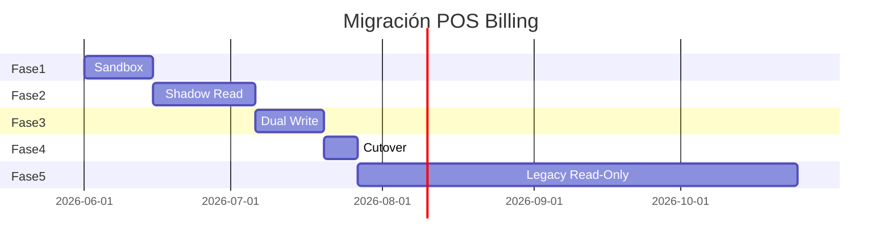
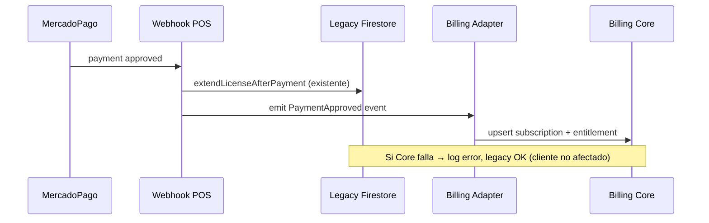

# POS → 0E3 Billing Core — Plan de migración

**Versión:** 1.0  
**Fecha:** 2026-05-27  
**Estado:** Diseño — **sin implementación en producción**

Migración incremental en **5 fases** con gates de aprobación humana entre cada una.

---

## Vista general

---

## Fase 1 — Sandbox

### Objetivo

Crear infraestructura Billing Core aislada y portar lógica extraída de POS **sin tocar prod**.

### Entregables

| Item | Detalle |
|---|---|
| Repo `0e3-billing` | Código + CI |
| Firebase `oe3-billing-sandbox` | Proyecto nuevo |
| Colecciones | `billingPlans`, `billingSubscriptions`, `tenantEntitlements`, `billingWebhooks`, `billingEvents` |
| Seed | Planes POS desde `platform/billing` (export manual, no live sync) |
| MP sandbox | Credenciales test; webhook → sandbox only |
| Tests | Unit: extend 30 días, idempotencia, amount match |

### POS — cambios

**Ninguno en prod.** Opcional script offline export precios legacy → JSON seed.

### Gate Fase 1 → 2

- [ ] Checkout sandbox end-to-end con MP test
- [ ] Webhook sandbox extiende `tenantEntitlements`
- [ ] Contratos validados con Ajv
- [ ] Review seguridad secrets

---

## Fase 2 — Shadow Read

### Objetivo

Comparar resultados Core vs legacy **en paralelo** sin impacto clientes.

### Entregables

| Item | Detalle |
|---|---|
| Scheduled diff job | Modo B en [`0e3-shadow-mode-plan.md`](0e3-shadow-mode-plan.md) |
| POS staging flag | `BILLING_SHADOW_READ=true` |
| Dashboard métricas | Match rate, mismatches |
| Runbook | Investigación mismatch |

### POS prod

**Sin cambios.** Legacy sigue siendo fuente de verdad.

### POS staging

- Callable post-`checkLicense` → Core sandbox (async, non-blocking)
- Webhook replay opcional (Modo A)

### Gate Fase 2 → 3

- [ ] ≥ 2 semanas shadow
- [ ] Match rate ≥ 99.5%
- [ ] Zero P1 mismatches sin explicación
- [ ] Aprobación humana

---

## Fase 3 — Dual Write

### Objetivo

Cada pago aprobado escribe **legacy + Core** en la misma transacción lógica.

### Flujo

### Implementación

1. **Adapter inline** en `billing-mercadopago.routes.js` — **solo tras flag** `BILLING_DUAL_WRITE=true`
2. Adapter invoca HTTP interno Core o escribe directo `tenantEntitlements` (decisión implementación)
3. `billingEvents` tipo `LEGACY_SYNC` por cada dual-write
4. Reconciliación nightly: legacy vs Core

### Rollback Fase 3

| Acción | Efecto |
|---|---|
| `BILLING_DUAL_WRITE=false` | Solo legacy escribe; Core queda stale |
| Reconciliar manual | Admin script sync from legacy |

### Gate Fase 3 → 4

- [ ] Dual-write staging 1 semana sin incidentes
- [ ] Dual-write prod canary (5% tenants) 1 semana
- [ ] Reconciliación 100% OK
- [ ] Ventana mantenimiento acordada

---

## Fase 4 — Cutover

### Objetivo

Billing Core es **fuente de verdad**; legacy entra en modo lectura.

### Secuencia (ventana planificada)

| Paso | Acción | Duración est. |
|---|---|---|
| 1 | Comunicación clientes 72h antes | — |
| 2 | Freeze cambios admin precios legacy | 1h |
| 3 | Migración final bulk `licenses/` → `tenantEntitlements` | 30 min |
| 4 | `checkLicense()` consulta Core primero, fallback legacy 24h | — |
| 5 | Webhook URL MP → endpoint Core (o proxy) | 15 min |
| 6 | Desactivar `extendLicenseAfterPayment` legacy write | — |
| 7 | Smoke test pagos reales (canary org) | 1h |
| 8 | Monitoreo intensivo 48h | — |

### POS cambios

- `checkLicense()` → `EntitlementService.get(tenantId, 'pos')`
- Frontend `getBillingPublicConfig()` → Core API
- Admin billing → panel Core

### Rollback Fase 4

| Condición | Acción |
|---|---|
| Fallo crítico < 4h post-cutover | Revertir webhook URL a legacy; reactivar dual-write legacy-primary |
| Fallo > 4h con pagos en Core | Forward sync Core → legacy; no revertir webhook |

---

## Fase 5 — Legacy Read-Only

### Objetivo

Retirar dependencia de colecciones legacy manteniendo **histórico consultable**.

### Acciones

| Timeline | Acción |
|---|---|
| D+0 cutover | `licenses/`, `companies/.../license` — **no writes** |
| D+30 | Remover dual-write adapter code |
| D+60 | Archivar `billingMercadoPago/*` → cold storage export |
| D+90 | Deprecar lectura legacy en `checkLicense` |
| D+180 | Evaluar eliminación docs legacy (solo tras backup) |

### Datos preservados

| Colección | Destino |
|---|---|
| `billingMercadoPago/*` | Export GCS + referencia en `billingWebhooks` |
| `licenses/{orgId}` | Snapshot final en `billingEvents` tipo `LEGACY_ARCHIVE` |
| `platform/billing` | Redirect lectura a `billingPlans` |

---

## Matriz de riesgo por fase

| Fase | Riesgo principal | Mitigación |
|---|---|---|
| 1 Sandbox | Ninguno prod | Proyecto aislado |
| 2 Shadow | Costo Firestore reads | Sample tenants + rate limit |
| 3 Dual-write | Desync | Legacy primary; reconciliación |
| 4 Cutover | Pérdida pagos webhook | Canary + rollback URL |
| 5 Legacy | Pérdida histórico | Export antes deprecar |

---

## Fuera de alcance (esta migración)

- Gastro billing staging
- HOME / Aliados greenfield
- Cambio precios comerciales
- AFIP / facturación electrónica

---

## Referencias

- Extracción: [`0e3-pos-billing-extraction-plan.md`](0e3-pos-billing-extraction-plan.md)
- Shadow: [`0e3-shadow-mode-plan.md`](0e3-shadow-mode-plan.md)
- Riesgos: [`0e3-billing-risk-register.md`](0e3-billing-risk-register.md)
- Rollout general: [`0e3-billing-rollout-plan.md`](0e3-billing-rollout-plan.md)
