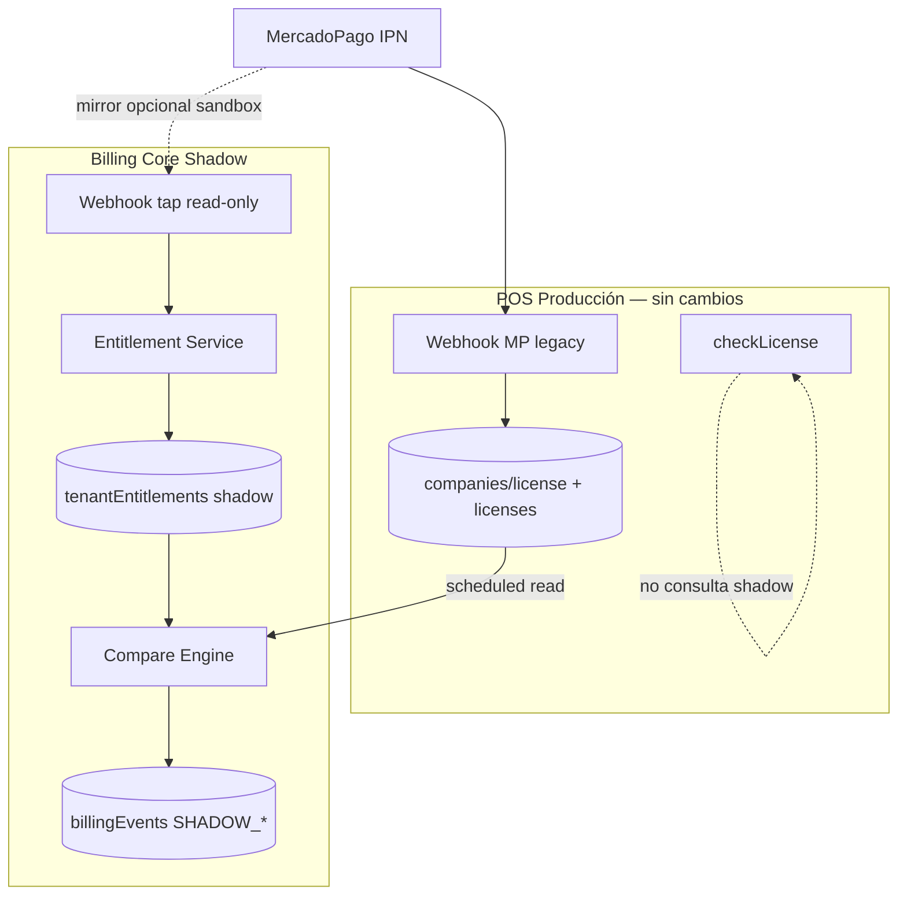

# 0E3 Billing Core — Plan de Shadow Mode

**Versión:** 1.0  
**Fecha:** 2026-05-27  
**Estado:** Diseño — **sin implementación**

Objetivo: ejecutar **Billing Core en paralelo** al billing POS actual, **sin modificar comportamiento visible** para clientes.

---

## Principio rector

> El cliente sigue pagando y operando vía POS legacy. Billing Core **observa, calcula y compara** — nunca escribe en prod durante shadow.

---

## Arquitectura shadow



---

## Modos de shadow

### Modo A — Replay webhook (sandbox)

1. Webhook prod procesado por POS (sin cambios).
2. Copia del payload enviada a endpoint shadow (sandbox Firebase).
3. Core procesa en colecciones **sandbox** aisladas.
4. Compare engine lee legacy prod (read-only) vs entitlement sandbox.

**Ventaja:** no toca prod Firestore Core.  
**Requisito:** tap async post-respuesta 200 OK en POS — **solo en staging primero**.

### Modo B — Scheduled diff (recomendado Fase 2 shadow)

1. Job cada 15 min (Cloud Scheduler → Function).
2. Lista tenants POS activos (sample o full).
3. Lee `companies/{orgId}/config/license` (read-only).
4. Core **recomputa** entitlement desde reglas + `billingPlans`.
5. Compara vs legacy `paidUntil`, `blocked`, `plan`.
6. Escribe `billingEvents` tipo `SHADOW_MATCH` / `SHADOW_MISMATCH`.

**Ventaja:** cero cambio en webhook prod.  
**Desventaja:** lag hasta 15 min post-pago.

### Modo C — Inline shadow-read en POS staging

1. Feature flag `BILLING_SHADOW_READ=true` **solo staging**.
2. Tras `checkLicense()` legacy, callable async a Core sandbox.
3. Log mismatch — **no bloquea request**.

**Prohibido en prod** hasta validación completa.

---

## Lectura paralela

| Fuente legacy | Lectura Core shadow | Campo comparado |
|---|---|---|
| `licenses/{orgId}.paidUntil` | `tenantEntitlements/{orgId}_pos.activeUntil` | Fecha vigencia (±1 min tolerancia) |
| `licenses/{orgId}.blocked` | `tenantEntitlements.blocked` | Boolean |
| `licenses/{orgId}.plan` | `tenantEntitlements.planId` | Map normalizado |
| `billingMercadoPago/pay_{id}` | `billingWebhooks/mercadopago_pay_{id}` | Idempotencia aplicada |
| `platform/billing.planPrices` | `billingPlans/pos_*` | Montos |

### Reglas de equivalencia

```typescript
function datesEquivalent(legacy: string, core: string): boolean {
  const diffMs = Math.abs(new Date(legacy).getTime() - new Date(core).getTime());
  return diffMs <= 60_000; // 1 min — legacy usa ISO string, core Timestamp
}

function planEquivalent(legacyPlan: string, corePlanId: string): boolean {
  const map = { basic: 'pos_basic', intermediate: 'pos_intermediate', premium: 'pos_premium' };
  return map[normalize(legacyPlan)] === corePlanId;
}
```

---

## Comparación de resultados

### Documento `tenantEntitlements.shadow`

```typescript
shadow: {
  legacyPaidUntil: string;
  coreActiveUntil: string;
  lastComparedAt: string;
  mismatch: boolean;
  mismatchFields: string[];  // ['activeUntil', 'planId', 'blocked']
  compareMode: 'scheduled' | 'webhook_replay' | 'inline';
}
```

### Evento `SHADOW_MISMATCH`

```json
{
  "type": "SHADOW_MISMATCH",
  "tenantId": "org_abc",
  "productId": "pos",
  "payload": {
    "fields": ["activeUntil"],
    "legacy": { "paidUntil": "2026-06-15T..." },
    "core": { "activeUntil": "2026-06-14T..." },
    "paymentId": "123456789"
  }
}
```

### SLA shadow

| Métrica | Objetivo Fase 2 |
|---|---|
| Match rate | ≥ 99.5% tenants sample |
| Mismatch post-webhook | < 0.1% pagos |
| Tiempo detección | < 30 min (Modo B) |

---

## Métricas

| Métrica | Fuente | Dashboard |
|---|---|---|
| `billing.shadow.compare.total` | Counter | Cloud Monitoring |
| `billing.shadow.compare.mismatch` | Counter | Alert si > threshold |
| `billing.shadow.webhook.replay.latency_ms` | Histogram | |
| `billing.shadow.entitlement.drift_days` | Gauge | Max drift paidUntil |
| Match rate % | `mismatch / total` | Semanal report |

### Alertas

| Condición | Acción |
|---|---|
| Mismatch rate > 1% en 1h | Slack/email equipo billing |
| Drift > 1 día en activeUntil | P1 investigación |
| Webhook replay failures > 5 | Revisar sandbox MP token |

---

## Rollback

Shadow mode es **inherentemente reversible**:

| Acción | Efecto |
|---|---|
| Desactivar flag `BILLING_SHADOW_READ` | POS staging deja de llamar Core |
| Pausar Cloud Scheduler job | Stop scheduled diff |
| Eliminar tap webhook | Solo legacy procesa |
| Borrar colecciones sandbox | Cero impacto prod |

**No hay rollback de datos prod** porque shadow **nunca escribe prod**.

---

## Observabilidad

### Logs estructurados

```json
{
  "severity": "INFO",
  "component": "billing-shadow",
  "tenantId": "org_abc",
  "productId": "pos",
  "compareMode": "scheduled",
  "match": true,
  "durationMs": 42
}
```

### Trace correlación

- `correlationId` = `paymentId` o `webhookId`
- Propagar en POS staging tap → Core shadow

### Reporte semanal

Generar desde `billingEvents` where `type IN (SHADOW_MATCH, SHADOW_MISMATCH)`:

- Total comparaciones
- Top mismatch fields
- Tenants afectados
- Recomendación go/no-go dual-write

---

## Criterios exit shadow → dual-write

| # | Criterio |
|---|---|
| 1 | ≥ 2 semanas shadow sin P1 mismatches |
| 2 | Match rate ≥ 99.5% |
| 3 | Replay 100% webhooks staging OK |
| 4 | Runbook rollback probado |
| 5 | Aprobación humana explícita |

---

## Restricciones (esta fase)

- ❌ No modificar webhook URL MP prod
- ❌ No dual-write prod
- ❌ No cambiar `checkLicense()` prod
- ❌ No Gastro / OTA
- ✅ Sandbox Firebase dedicado
- ✅ POS staging como primer entorno shadow

---

## Referencias

- Migración por fases: [`0e3-pos-migration-plan.md`](0e3-pos-migration-plan.md)
- Riesgos: [`0e3-billing-risk-register.md`](0e3-billing-risk-register.md)
- Contratos: [`0e3-billing-contracts.md`](0e3-billing-contracts.md)
