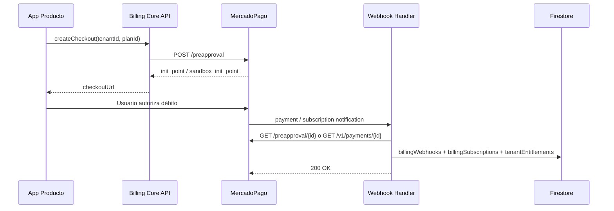

# Plan integración MercadoPago — 0E3 Billing Core

**Versión:** 0.1 (diseño)  
**Fecha:** 2026-05-27  
**Estado:** Documentación — **sin configurar credenciales reales**

---

## Modelo de cuenta

### Fase 1 — Cuenta 0E3 central (recomendado)

| Aspecto | Decisión |
|---|---|
| **Titular** | 0E3 / Cero Es Tres (cuenta MP del negocio) |
| **Uso** | Cobrar abonos SaaS de POS, Gastro, Home, Aliados |
| **Credenciales** | Access token **solo backend** (Firebase Secrets) |
| **Ambientes** | Credenciales **test** para staging; **prod** separadas |

> Los comercios finales (restaurantes, tiendas) **no** conectan su MP para el abono SaaS — pagan a 0E3.

### Fase futura — OAuth / Marketplace (opcional)

| Escenario | Cuándo |
|---|---|
| POS cobra ventas con MP del comercio | Ya existe como método de pago en mostrador — **distinto** de billing SaaS |
| Split / comisiones marketplace | Solo si 0E3 intermedia cobros de terceros — **no requerido v1** |
| OAuth MP por tenant | Evaluar si comercios conectan cuenta propia para billing directo |

**Recomendación v1:** OAuth **no** necesario. Usar **preapproval / suscripciones** con cuenta central 0E3.

---

## Mecanismos MP a utilizar

| Mecanismo | Uso Billing Core |
|---|---|
| **Preapproval (suscripción)** | Abono mensual recurrente — **preferido** |
| **preapproval_plan** | Planes fijos en MP (`MP_PLAN_*_PREAPPROVAL_PLAN_ID`) |
| **Checkout Pro (preferencia)** | Pagos únicos, onboarding kit, reactivación |
| **Webhooks IPN** | **Obligatorios** — fuente de verdad async |

### Flujo suscripción (preapproval)



---

## Secrets y configuración

| Secret / env | Dónde | Nunca en |
|---|---|---|
| `MERCADOPAGO_ACCESS_TOKEN` o `MP_ACCESS_TOKEN` | Firebase Secret Manager | Frontend, repo Git |
| `MP_WEBHOOK_SECRET` | Secret — validación HMAC | Cliente |
| `MP_BACK_URL` | Config Functions | Hardcode prod sin revisión |
| `MP_*_PREAPPROVAL_PLAN_ID` | Config por plan | Flutter/React bundle |

**Unificar naming** en Billing Core: preferir `BILLING_MP_ACCESS_TOKEN` por proyecto Firebase.

---

## Webhooks

### URL

```
https://{region}-{project}.cloudfunctions.net/billingMercadoPagoWebhook
```

O ruta en API unificada por producto durante migración:

```
/api/billing/mercadopago/webhook
```

### Reglas

1. **Siempre** persistir payload crudo en `billingWebhooks/{id}` antes de procesar
2. **Idempotencia:** `providerEventId` o `paymentId` — skip si ya procesado
3. **Confirmar** estado consultando API MP (no confiar solo en body)
4. Responder **200** rápido; reproceso async si necesario
5. Validar firma `x-signature` + `x-request-id` cuando `MP_WEBHOOK_SECRET` configurado

### Eventos a manejar

| Evento MP | Acción Billing Core |
|---|---|
| Pago **approved** | Extender `activeUntil`, status → `active` |
| Pago **rejected** | status → `past_due` o mantener gracia |
| Pago **pending** | status → `pending`, no extender |
| Suscripción **authorized/active** | Activar entitlement |
| Suscripción **paused** | status → `paused` |
| Suscripción **cancelled** | status → `canceled`, calcular fin período |
| **Refunded/charged_back** | Registrar en `billingPayments`, evaluar downgrade |

---

## external_reference

Formato unificado propuesto:

```
{tenantId}:{productId}:{planId}:{intentId}
```

Ejemplo: `org-abc123:pos:premium:chk_20260527_x`

Compatible con parsers legacy POS (`orgId`) y Gastro (`tenantId:plan`).

---

## Seguridad frontend

| Regla | Implementación |
|---|---|
| Sin access_token en cliente | Solo `checkoutUrl` del backend |
| Config pública | Precios, flags `mercadoPagoConfigured` — sin secretos |
| Deep links post-pago | `MP_BACK_URL` → `/billing?status=...` |

---

## Ambientes

| Entorno | MP creds | Webhook URL |
|---|---|---|
| Gastro staging | TEST | `e3-gastro-staging.web.app` o custom staging |
| POS staging | TEST | `nexopos-dc-staging` (cuando exista deploy) |
| POS prod | PROD | `nexopos-dc.web.app` / `pos.0e3.com.ar` |
| Billing Core sandbox | TEST | Proyecto Firebase dedicado opcional |

**No mezclar** tokens test/prod en mismo secret.

---

## Coexistencia con billing legacy

Durante migración:

1. Webhook legacy sigue activo en ruta actual
2. Billing Core escucha en ruta nueva **o** dispatcher en misma ruta con feature flag
3. Adapter escribe **tanto** campos legacy como `tenantEntitlements` hasta cutover
4. Cutover: solo Core escribe; legacy read-only

---

## Checklist pre-implementación (humano)

- [ ] Crear aplicación MP Developers para 0E3 Billing
- [ ] Obtener credenciales test
- [ ] Registrar webhook URL staging
- [ ] Definir preapproval_plan IDs por producto/plan
- [ ] Aprobar montos ARS por plan
- [ ] Legal: términos suscripción / cancelación

---

## Referencias existentes

- POS: `nexopos-dc-multi-tenant/docs/billing-mercadopago.md`
- Gastro: `nexopos_gastro_pos/docs/MERCADOPAGO_STAGING_SETUP.md`
- Core spec: [`0e3-billing-core-spec.md`](0e3-billing-core-spec.md)
