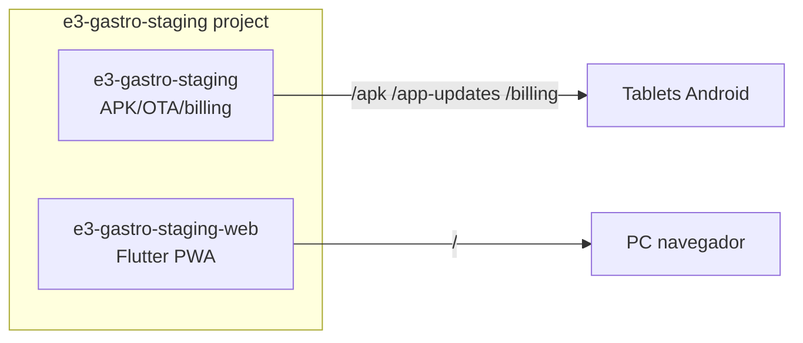

# Mapa de Hosting 0E3

**Actualizado:** 2026-05-28  
**Base:** auditoría + Fase 2

---

## Leyenda de estado

| Etiqueta | Significado |
|---|---|
| **producción** | Tráfico real o institucional publicado |
| **staging** | Pruebas pre-prod |
| **experimental** | Beta / dev |
| **crítico** | No tocar sin plan (OTA, billing, POS prod) |

---

## Tabla principal

| Producto | Proyecto Firebase | Site ID | URL actual | Dominio futuro | Estado | Etiqueta |
|---|---|---|---|---|---|---|
| **Landing institucional** | `oe3-institutional` | `0es3-com-ar` | https://0es3-com-ar.web.app | **https://0e3.com.ar** ✅ | Live + custom domain | producción |
| **Landing alias** | — | — | — | `0es3.com.ar` → redirect 301 | ✅ Cloudflare (manual) | producción |
| **0E3 POS / NexoPOS** | `nexopos-dc` | `nexopos-dc` | https://nexopos-dc.web.app | `pos.0e3.com.ar` | Live prod | **crítico** |
| **POS staging** | `nexopos-dc-staging` | default | https://nexopos-dc-staging.web.app | `demo.0e3.com.ar` | 404 / sin deploy | staging |
| **0E3 HOME** | `oe3-home-beta` | default | https://oe3-home-beta.web.app | `home.0e3.com.ar` | Live beta | experimental |
| **Aliados Comerciales** | `oe3-aliados-comerciales` | default | https://oe3-aliados-comerciales.web.app | `aliados.0e3.com.ar` | Live | staging |
| **Gastro web staging** | `e3-gastro-staging` | `e3-gastro-staging-web` | https://e3-gastro-staging-web.web.app | `staging.gastro.0e3.com.ar` | Live | staging |
| **Gastro APK/OTA/billing stg** | `e3-gastro-staging` | `e3-gastro-staging` | https://e3-gastro-staging.web.app | `staging.0e3.com.ar` | Live | **crítico** |
| **Gastro web prod** | `e3-gastro` | `e3-gastro-web` | https://e3-gastro-web.web.app | `gastro.0e3.com.ar` | 404 sin deploy | producción (futuro) |
| **Gastro APK prod** | `e3-gastro` | `e3-gastro` | https://e3-gastro.web.app | `gastro.0e3.com.ar` (APK) | 404 sin deploy | producción (futuro) |
| **Gastro OTA legacy dev** | `nexopos-dc` | `nexopos-gastro-pos` | https://nexopos-gastro-pos.web.app | — | Live legacy | experimental |
| **Docs** | TBD | TBD | GitHub | `docs.0e3.com.ar` | No desplegado | — |

---

## Diagrama de sites Gastro (separación crítica)

> **Nunca unificar** APK site con web site sin migración planificada.

---

## Proyectos Firebase del ecosistema

| Project ID | Productos | Hosting sites |
|---|---|---|
| `oe3-institutional` | Landing | `0es3-com-ar` |
| `nexopos-dc` | POS, OTA legacy gastro dev | `nexopos-dc`, `nexopos-gastro-pos` |
| `nexopos-dc-staging` | POS staging | default (404) |
| `oe3-home-beta` | 0E3 HOME | default |
| `oe3-aliados-comerciales` | Aliados | default |
| `e3-gastro-staging` | Gastro staging | `e3-gastro-staging`, `e3-gastro-staging-web` |
| `e3-gastro` | Gastro prod | `e3-gastro`, `e3-gastro-web` |

---

## Archivos de config Firebase por producto

| Producto | firebase.json | .firebaserc |
|---|---|---|
| Landing | `0E3_WORKSPACE/landing/firebase.json` | ✅ |
| Aliados | `aliados-comerciales/firebase.json` | ✅ |
| HOME | `oe3_home/firebase.json` | ignorado en Git |
| Gastro | `firebase.json` + `firebase.gastro-*.json` | ✅ |
| POS | `nexopos-dc-multi-tenant/firebase.json` | ✅ (otro repo) |

---

## Prioridad de cutover DNS (post Fase 2)

1. ✅ `0e3.com.ar` — landing (hecho)
2. `home.0e3.com.ar` — bajo riesgo
3. `aliados.0e3.com.ar` — bajo riesgo
4. `staging.gastro.0e3.com.ar` — riesgo medio (solo web)
5. `pos.0e3.com.ar` — **alto riesgo**
6. `staging.0e3.com.ar` — **crítico** (OTA/billing)
7. `gastro.0e3.com.ar` — cuando exista deploy prod
