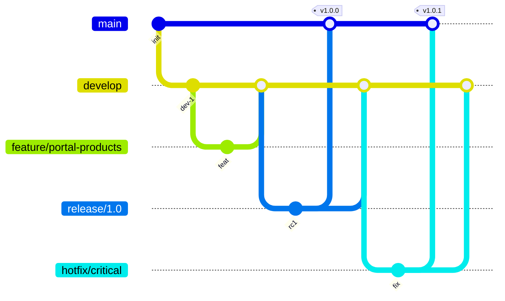

# Estrategia de ramas Git — 0E3

**Aplica a:** todos los repos `ceroes3group/*`

---

## Ramas estándar

| Rama | Propósito | Protección |
|---|---|---|
| **`main`** | Producción / deployable | ✅ Protected, solo merge vía PR |
| **`develop`** | Integración continua pre-prod | ✅ Protected, CI obligatorio |
| **`feature/*`** | Features e infraestructura | Efímera, delete post-merge |
| **`hotfix/*`** | Corrección urgente prod | Merge a `main` + backport `develop` |
| **`release/*`** | Estabilización pre-release | Merge a `main` y `develop` |

---

## Flujo Git Flow (recomendado)



---

## Convenciones

### Commits (Conventional Commits)

```
feat(scope): descripción
fix(scope): descripción
docs(scope): descripción
chore(scope): descripción
ci(scope): descripción
```

### Nombres de branch

```
feature/aliados-otp-ui
feature/portal-products-section
hotfix/gastro-webhook-signature
release/2026-q2
chore/oe3-architecture   ← rama de transición actual (migrar a develop)
```

---

## Estado actual por repo (2026-05-27)

| Repo | Rama activa | Acción recomendada |
|---|---|---|
| `0e3-landing` | `main` | ✅ Crear `develop` desde `main` |
| `0e3-docs` | `main` | ✅ Crear `develop` |
| `0e3-aliados` | `chore/oe3-architecture` | Merge → `develop`, luego PR a `main` |
| `0e3-home` | `chore/oe3-architecture` | Idem |
| `0e3-gastro` | `chore/oe3-architecture` | Alinear remoto → `develop` |
| `nexopos-dc` | `staging/0e3-migration` | Migrar org → estandarizar |

---

## Reglas de merge

1. **No push directo a `main`** (excepto hotfix documentado)
2. **CI verde** obligatorio antes de merge
3. **Squash merge** en features; **merge commit** en releases
4. **No force push** a `main` / `develop`

---

## Tags

```
v{major}.{minor}.{patch}
v1.0.0 — primera release portal
v1.1.0 — aliados DNS cutover
```

---

## Referencias

- Coordinación repos: [`coordinacion-repos.md`](coordinacion-repos.md)
- Gastro alineación: [`../0e3-gastro` repo] → `docs/GIT-REMOTE-ALIGNMENT.md` (en repo gastro)
